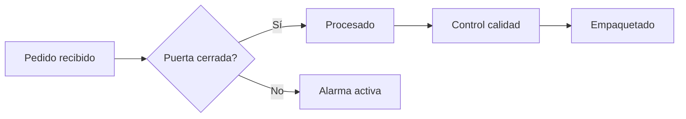
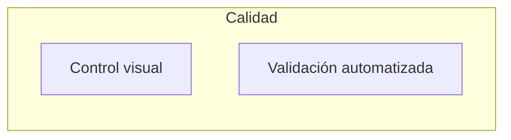
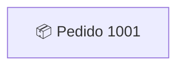
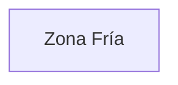

# 🔍 Fundamento Pedagógico: Representación Jerárquica y Flujos Complejos en Grafana

## 🎓 Introducción

La representación visual de procesos es una de las herramientas más poderosas para la comprensión, diagnóstico y toma de decisiones en contextos empresariales e industriales. Grafana, tradicionalmente conocida por su capacidad para visualizar series temporales y métricas, puede convertirse en una plataforma de **navegación jerárquica y exploración de flujos de negocio**, gracias a plugins como **Diagram Panel**, **FlowCharting** o **Status Map**.

Esta sesión del curso se centra en entender y aplicar estos principios para representar visualmente **procesos complejos con decisiones, bifurcaciones, excepciones y caminos alternativos**, utilizando herramientas accesibles y datos simples (como archivos CSV).

---

## 🌟 Objetivos específicos de la sesión

* Comprender el valor de representar un flujo de negocio como un grafo navegable.
* Aprender a usar Mermaid (Diagram Panel) para modelar decisiones y rutas condicionales.
* Representar jerarquías y niveles visuales dentro de un mismo dashboard.
* Preparar el terreno para una navegación contextual maestro-detalle.

---

## 🧠 Fundamento técnico y pedagógico

### 🔹 1. Pensar en flujos, no solo en métricas

Los sistemas de monitorización tradicionales muestran el "estado de algo" (CPU, latencia, errores, etc.). Pero en entornos de negocio o industria, lo que realmente importa es **dónde estamos en un proceso**:

* ¿Está el pedido siendo procesado?
* ¿Falló la validación de calidad?
* ¿Hubo una excepción en logística?

Representar visualmente el camino seguido por una entidad (pedido, sensor, evento) dentro del flujo es lo que permite al operador comprender **el contexto completo**.

### 🔹 2. Mermaid y Diagram Panel: Lenguaje de flujos

Con Mermaid, podemos crear diagramas declarativos como:

Esto permite modelar condicionales, excepciones y subflujos con una sintaxis simple y legible. Cada nodo puede representar un estado, una acción o un punto de decisión.

### 🔹 3. Jerarquía visual y agrupación por niveles

Mediante `subgraph`, podemos agrupar nodos y crear una jerarquía visual:

Esto permite representar sistemas tipo SCADA, donde cada bloque representa una "zona", "cámara" o "etapa de planta".

---

## 🔍 Introducción al concepto maestro-detalle

Una vez definido el flujo general, Grafana permite conectar nodos con otros dashboards mediante `click`:

Esto nos permite:

* Hacer clic en un nodo del overview y abrir un dashboard específico.
* Pasar variables (¿qué pedido, qué sensor?) mediante la URL.
* Reutilizar dashboards de detalle con variables dinámicas (`$camara`, `$pedido`, etc.).

---

## 🔢 El papel de las variables en la navegación jerárquica

Las **variables en Grafana** actúan como filtros dinámicos y contextuales:

* En un overview, permiten centrar la atención en una zona, cliente o entidad.
* En dashboards de detalle, permiten adaptar los paneles a una selección (`$camara = Camara_1`).
* Son reutilizables y compatibles con CSV, SQL, Prometheus, etc.

Ejemplo de uso:

---

## 🫲 Aplicación directa en la sesión

Durante esta sesión, los alumnos:

1. Modelarán un flujo realista con al menos una bifurcación y una excepción.
2. Agruparán etapas usando `subgraph` para ganar claridad.
3. Integrarán variables como `$pedido` para preparar navegabilidad.
4. Añadirán enlaces tipo `click` para vincular con dashboards de detalle.
5. Discutirán estrategias para reflejar el estado de un proceso de forma clara, jerárquica y navegable.

---

## 📍 Conclusión

Esta fase del curso no solo entrena habilidades técnicas, sino que **cambia la forma en que los alumnos entienden el diseño de dashboards**. Ya no se trata de "ver métricas" sino de **navegar procesos**, **entender recorridos** y **visualizar el flujo del negocio como una historia**.

Este cambio de paradigma es esencial para evolucionar de una simple monitorización a una **representación operacional completa**, que es precisamente lo que demandan hoy los entornos industriales, logísticos y de gestión avanzada.
