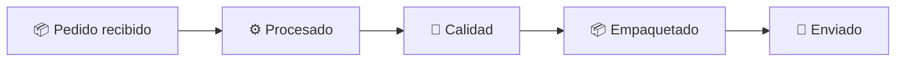

## 📦 Inventario de Recursos Necesarios

---

### 1️⃣ **Datos CSV para el servidor estático**

Todos los ficheros deben colocarse en el directorio `./data` del contenedor `static-server`.

---

#### ✅ `camaras.csv`

Contiene el estado resumido de cada cámara.

```csv
camara,temp,humedad,puerta,compresor,alarma
Camara_1,-2.4,78,Cerrada,ACTIVO,INACTIVA
Camara_2,-1.7,83,Abierta,ACTIVO,ACTIVA
Camara_3,-3.1,75,Cerrada,INACTIVO,INACTIVA
```

---

#### ✅ `historico_camaras.csv`

Simula un histórico diario por cámara para pruebas de gráficas y umbrales.

```csv
fecha,camara,temp,humedad
2024-06-01,Camara_1,-2.3,77
2024-06-01,Camara_2,-1.5,84
2024-06-01,Camara_3,-3.2,76
2024-06-02,Camara_1,-2.4,78
2024-06-02,Camara_2,-1.6,83
2024-06-02,Camara_3,-3.1,75
```

---

#### ✅ `pedidos.csv`

Simula pedidos y estados para representar un flujo lógico de negocio.

```csv
pedido_id,estado,fecha,categoria
1001,Recepcionado,2024-06-01,Vacuno
1002,Procesado,2024-06-02,Porcino
1003,Calidad,2024-06-02,Ovino
1004,Empaquetado,2024-06-03,Vacuno
1005,Enviado,2024-06-03,Ovino
```

---

### 2️⃣ **Panel Diagram (Mermaid) para Overview SCADA**

Archivo de configuración o copia en panel:

```mermaid
graph LR
  subgraph Cámara_1 [Cámara 1 - Vacuno]
    T1[🌡️ Temp: ${temp_c1}]
    H1[💧 Humedad: ${hum_c1}]
    D1[🚪 Puerta: ${door_c1}]
    C1[⚙️ Compresor: ${comp_c1}]
    A1[🚨 Alarma: ${alarm_c1}]
  end

  subgraph Cámara_2 [Cámara 2 - Porcino]
    T2[🌡️ Temp: ${temp_c2}]
    H2[💧 Humedad: ${hum_c2}]
    D2[🚪 Puerta: ${door_c2}]
    C2[⚙️ Compresor: ${comp_c2}]
    A2[🚨 Alarma: ${alarm_c2}]
  end

  subgraph Cámara_3 [Cámara 3 - Ovino]
    T3[🌡️ Temp: ${temp_c3}]
    H3[💧 Humedad: ${hum_c3}]
    D3[🚪 Puerta: ${door_c3}]
    C3[⚙️ Compresor: ${comp_c3}]
    A3[🚨 Alarma: ${alarm_c3}]
  end

  style Cámara_1 fill:#d0f0c0,stroke:#27ae60,stroke-width:2px
  style Cámara_2 fill:#f9ebea,stroke:#e74c3c,stroke-width:2px
  style Cámara_3 fill:#e8f8f5,stroke:#1abc9c,stroke-width:2px

  click Cámara_1 "d/camara-detail?var-camara=Camara_1" "Ver detalle"
  click Cámara_2 "d/camara-detail?var-camara=Camara_2" "Ver detalle"
  click Cámara_3 "d/camara-detail?var-camara=Camara_3" "Ver detalle"
```

> 🧠 **Variables como `${temp_c1}` deben definirse mediante transformaciones con `Reduce` + `Merge` + `Rename by regex`.**

---

### 3️⃣ **Dashboard `camara-detail`**

* Variable `$camara`
* Query sobre `historico_camaras.csv` filtrada por `$camara`
* Diagram Panel reutilizable para representar visualización individual
* Mini-gráficas con históricos

---

### 4️⃣ **Dashboard `pedido-overview`**

* Diagram Panel con flujo como este:



---

### 5️⃣ **Dashboard `pedido-detail`**

* Variable `$pedido`
* Tabla con todos los detalles
* Diagram Panel con flujo condicional para el pedido
* Breadcrumb o botón de retorno

---

### 6️⃣ **Configuración de red interna de Grafana**

* Datasource tipo `CSV over HTTP` con URL relativa:

  ```
  http://static-server:8080/camaras.csv
  ```

---

### 7️⃣ **Otros recursos sugeridos**

* Capturas o markdown con botones tipo:

  ```markdown
  [🔙 Volver al overview](/d/overview-scada)
  ```

* Filtros dinámicos: variables `$categoria`, `$estado`, `$camara`
